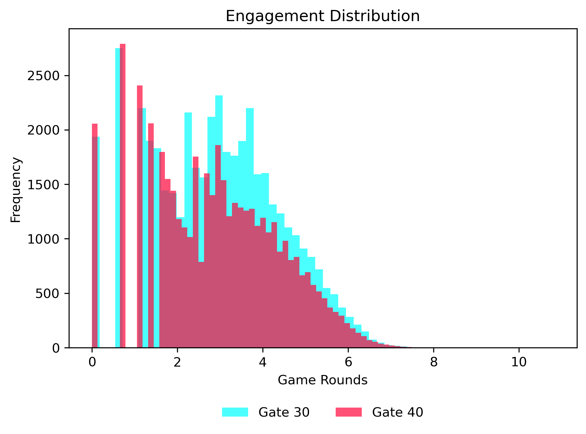

# Cookie Cats A/B Test — Gate 30 vs Gate 40 (Python)

This project evaluates an A/B test from the mobile game **Cookie Cats**. Users were randomly assigned to:
- **Control:** `gate_30` (first gate at level 30)
- **Treatment:** `gate_40` (first gate at level 40)

Goal: determine whether moving the gate affects **retention** and **engagement**, and make a clear **ship / no-ship** recommendation.

---

## Dataset
Public dataset: “Mobile Games A/B Testing – Cookie Cats” (Kaggle).  
The raw CSV is not committed to this repo. To reproduce:
1. Download `cookie_cats.csv` from Kaggle
2. Place it at `data/raw/cookie_cats.csv`

Columns used:
- `userid`, `version`
- `retention_1` (Day-1 retention), `retention_7` (Day-7 retention)
- `sum_gamerounds` (engagement proxy)

---

## Methodology (what the analysis does)
### Retention (binary metrics)
For `retention_1` and `retention_7`:
- Compute group rates: `p_control`, `p_treat`
- Compute **lift**: `p_treat - p_control`
- Run a **two-proportion z-test** to quantify statistical significance
- Report **95% confidence interval** for the lift

### Bootstrap uncertainty (retention_7)
- Resample users with replacement (5,000 draws)
- Recompute lift each draw → distribution of plausible lifts
- Compute bootstrap CI and `P(lift > 0)` for intuitive decision support

### Engagement (skewed metric)
- Summarize mean/median of `sum_gamerounds`
- Use a non-parametric test (Mann–Whitney U)
- Visualize distributions on `log1p(sum_gamerounds)` scale (robust to heavy tails)

---

## Results (headline)
### Day-1 retention
- Control: **44.82%**
- Treatment: **44.23%**
- Lift: **-0.59 pp** (relative: -1.32%)
- p-value: **0.074**
- 95% CI: **[-1.24 pp, +0.06 pp]**
**Interpretation:** slight negative effect, not significant at 5%.

### Day-7 retention (primary KPI)
- Control: **19.02%**
- Treatment: **18.20%**
- Lift: **-0.82 pp** (relative: -4.31%)
- p-value: **0.0016**
- 95% CI: **[-1.33 pp, -0.31 pp]**
**Interpretation:** statistically significant decrease in long-term retention.

### Bootstrap confirmation
- `P(lift > 0) = 0` (best bootstrap draw had lift = 0)
**Interpretation:** across 5,000 resamples, treatment never outperformed control on 7-day retention.

---

## Decision
✅ **Reject treatment (`gate_40`)**  
The treatment produces a consistent and statistically significant **decline in 7-day retention**, with bootstrap draws fully at/below zero.

---

## Key visuals
### Engagement distribution (log scale)

### Bootstrap distribution (retention_7 lift)

